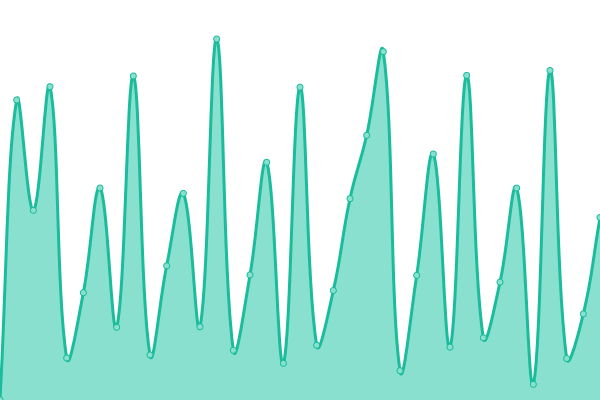

<!--start: status pages-->
<!-- This summary is generated by Upptime (https://github.com/upptime/upptime) -->
<!-- Do not edit this manually, your changes will be overwritten -->
<!-- prettier-ignore -->
| URL | Status | History | Response Time | Uptime |
| --- | ------ | ------- | ------------- | ------ |
|  [Noise宝藏阁](https://noisevip.cn) | 🟩 Up | [noise.yml](https://github.com/rcy1314/runtime/commits/HEAD/history/noise.yml) | 

 1045ms
     
 | 

<a href="https://rcy1314.github.io/runtime/history/noise">94.33%</a>
    

|  [Noise社区站](https://www.efficiency.vip) | 🟩 Up | [noise.yml](https://github.com/rcy1314/runtime/commits/HEAD/history/noise.yml) | 

 1045ms
     
 | 

<a href="https://rcy1314.github.io/runtime/history/noise">94.33%</a>
    

|  [Noise导航站](https://www.noisedh.cn) | 🟩 Up | [noise.yml](https://github.com/rcy1314/runtime/commits/HEAD/history/noise.yml) | 

 1045ms
     
 | 

<a href="https://rcy1314.github.io/runtime/history/noise">94.33%</a>
    

|  [频道推送器](https://www.efficiencynoise.top) | 🟥 Down | [.yml](https://github.com/rcy1314/runtime/commits/HEAD/history/.yml) | 

 1106ms
     
 | 

<a href="https://rcy1314.github.io/runtime/history/">94.33%</a>
    

|  [Noise资源库](https://www.noiseyp.top) | 🟩 Up | [noise.yml](https://github.com/rcy1314/runtime/commits/HEAD/history/noise.yml) | 

 1045ms
     
 | 

<a href="https://rcy1314.github.io/runtime/history/noise">94.33%</a>
    

|  [Noise知识效率集](https://www.noisesite.cn) | 🟩 Up | [noise.yml](https://github.com/rcy1314/runtime/commits/HEAD/history/noise.yml) | 

 1045ms
     
 | 

<a href="https://rcy1314.github.io/runtime/history/noise">94.33%</a>
    

<!--end: status pages-->
